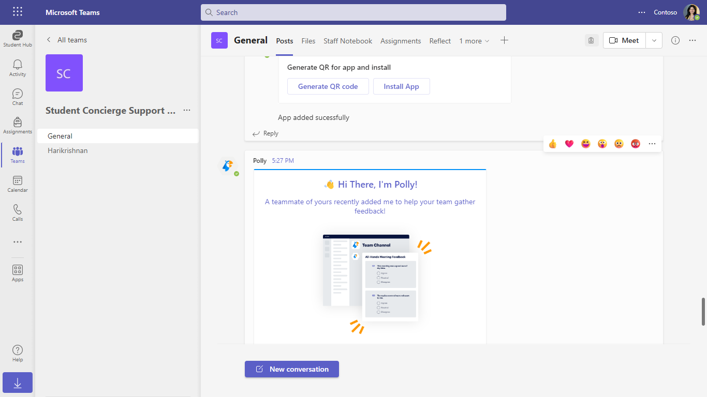
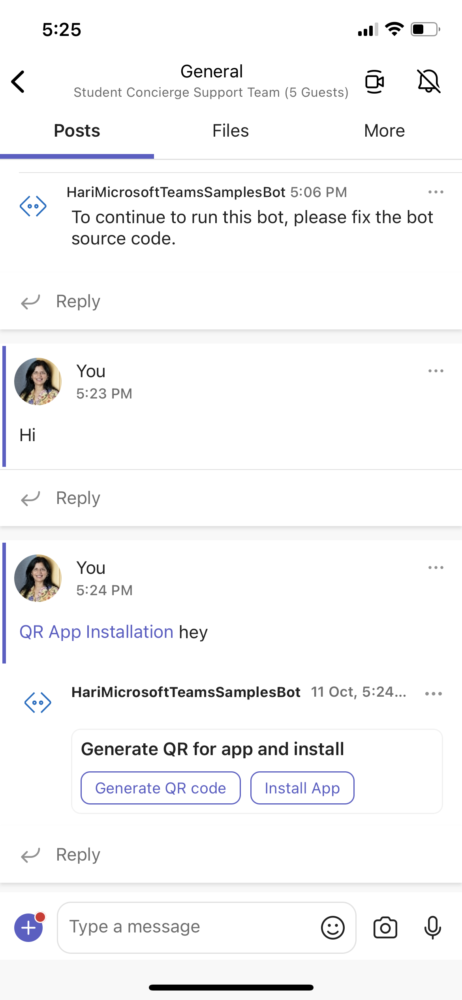
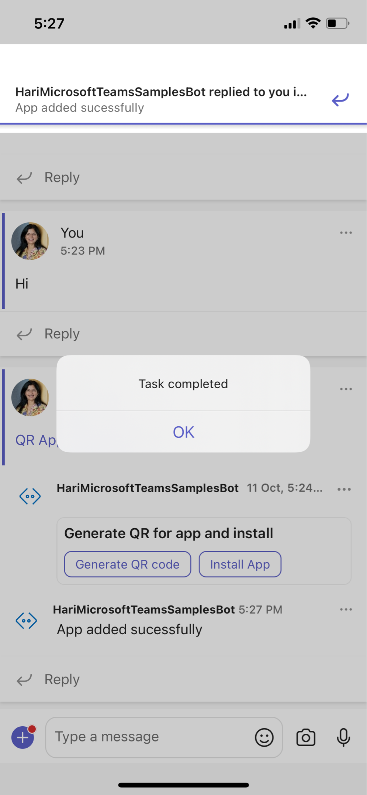
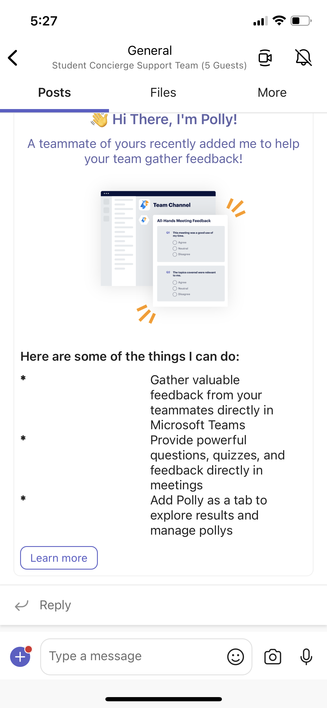

# Install app using barcode sample

This sample demos app installation using QR code.

The user can Generate a new QR code (contains app id information) and then use Install action to scan and install the app.

`Currently, Microsoft Teams support for QR or barcode scanner capability is only available for mobile clients`

**Interaction with bot - Desktop View**


**Interaction with bot - Mobile View**


## Try it yourself - experience the App in your Microsoft Teams client
Please find below demo manifest which is deployed on Microsoft Azure and you can try it yourself by uploading the app package (.zip file link below) to your teams and/or as a personal app. (Sideloading must be enabled for your tenant, [see steps here](https://docs.microsoft.com/microsoftteams/platform/concepts/build-and-test/prepare-your-o365-tenant#enable-custom-teams-apps-and-turn-on-custom-app-uploading)).

**Install app using barcode sample:** [Manifest](/samples/app-installation-using-qr-code/csharp/demo-manifest/App-Installation-Using-QR.zip)

## Prerequisites

- Microsoft Teams is installed and you have an account (not a guest account)
-  To test locally, [NodeJS](https://nodejs.org/en/download/) must be installed on your development machine (version 16.14.2  or higher)
-  [ngrok](https://ngrok.com/) or equivalent tunneling solution
-  [M365 developer account](https://docs.microsoft.com/microsoftteams/platform/concepts/build-and-test/prepare-your-o365-tenant) or access to a Teams account with the 
   appropriate permissions to install an app.

## Setup

> Note these instructions are for running the sample on your local machine, the tunnelling solution is required because
> the Teams service needs to call into the bot.

1) Setup for Bot SSO
- Refer to [Bot SSO Setup document](../BotSSOSetup.md)

- Ensure that you've [enabled the Teams Channel](https://docs.microsoft.com/azure/bot-service/channel-connect-teams?view=azure-bot-service-4.0)
- While registering the Azure bot, use `https://<your_ngrok_url>/api/messages` as the messaging endpoint.
    
    > NOTE: When you create your app registration in Azure portal, you will create an App ID and App password - make sure you keep these for later.

2) Setup for code
- Clone the repository

    ```bash
    git clone https://github.com/OfficeDev/Microsoft-Teams-Samples.git
    ```

- In a terminal, navigate to `samples/app-installation-using-qr-code/nodejs`

- Install modules

    ```bash
    npm install
    ```

- Run ngrok - point to port 3978

    ```bash
    ngrok http -host-header=rewrite 3978
    ```

- Update the `.env` configuration file for the bot to use the `MicrosoftAppId` and `MicrosoftAppPassword` from the AAD app registration in Azure portal or from the Bot Framework registration. (Note that the MicrosoftAppId is the AppId created in step 1 (Setup for Bot SSO), the MicrosoftAppPassword is referred to as the "client secret" in step 1 (Setup for Bot SSO) and you can always create a new client secret anytime.)
    - Also, update `connectionName` as the name of your Azure Bot connection created in previous steps.
    - `connectionName` - The OAuthConnection setting from step 1, from Azure Bot SSO setup.
    - `BaseUrl` with application base url. For e.g., your ngrok url https://xxx.ngrok.io

- Run your app

    ```bash
    npm start
    ```

3) **Manually update the manifest.json**
    - Edit the `manifest.json` contained in the  `appPackage/` folder to replace with your MicrosoftAppId (that was created in step1 and is the same value of MicrosoftAppId in `.env` file) *everywhere* you see the place holder string `{{MicrosoftAppId}}` (depending on the scenario the Microsoft App Id may occur multiple times in the `manifest.json`)
    - `{{domain-name}}` with base Url domain. E.g. if you are using ngrok it would be `https://1234.ngrok.io` then your domain-name will be `1234.ngrok.io`.
    - Zip up the contents of the `appPackage/` folder to create a `manifest.zip`
    - Upload the `manifest.zip` to Teams (in the left-bottom *Apps* view, click "Upload a custom app")

    > IMPORTANT: The manifest file in this app adds "token.botframework.com" to the list of `validDomains`. This must be included in any bot that uses the Bot Framework OAuth flow.

**Note**: If you are facing any issue in your app, please uncomment [this](https://github.com/OfficeDev/Microsoft-Teams-Samples/blob/main/samples/app-installation-using-qr-code/nodejs/index.js#L48) line and put your debugger for local debug.

## Running the sample

- **Desktop View**
**Card with actions Generate QR code and Install App:**


**Generate QR code is used to generate a QR code by selecting the app:**


**Install App is used to Scan the QR code and it then installs the app:**



-  **Mobile View**
**Hey command interaction:**



**Permission App Also add following permission:**


**QR Code:**


**App added:**



**Polly App Install:**



## Deploy the bot to Azure

To learn more about deploying a bot to Azure, see [Deploy your bot to Azure](https://aka.ms/azuredeployment) for a complete list of deployment instructions.

## Further reading

- [Bot Framework Documentation](https://docs.botframework.com)
- [Bot Basics](https://docs.microsoft.com/azure/bot-service/bot-builder-basics?view=azure-bot-service-4.0)
- [Azure Bot Service Introduction](https://docs.microsoft.com/azure/bot-service/bot-service-overview-introduction?view=azure-bot-service-4.0)
- [Azure Bot Service Documentation](https://docs.microsoft.com/azure/bot-service/?view=azure-bot-service-4.0)
- [Integrate media Capabilities inside your app](https://learn.microsoft.com/microsoftteams/platform/concepts/device-capabilities/media-capabilities?tabs=mobile)