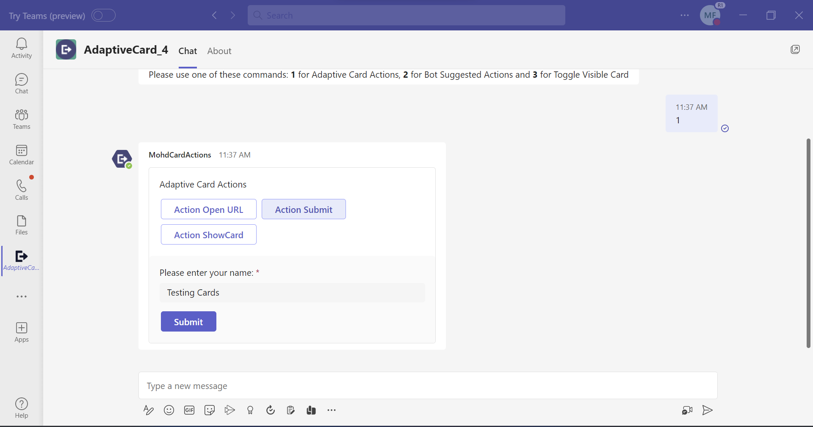
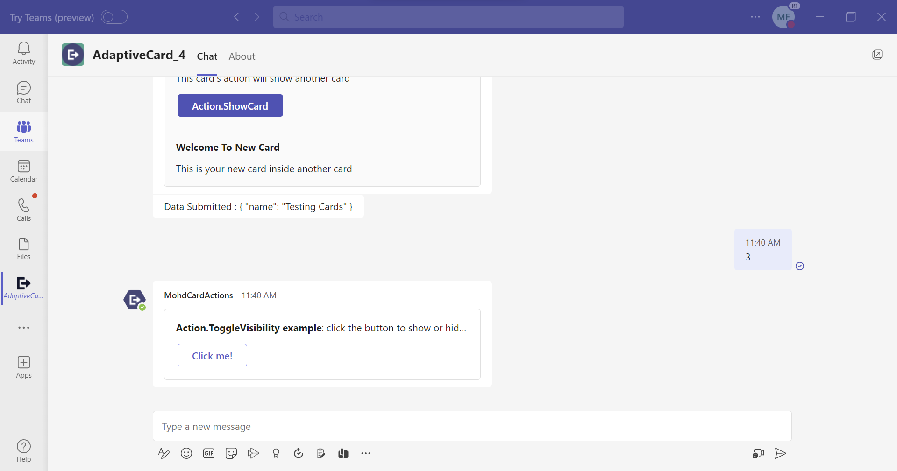
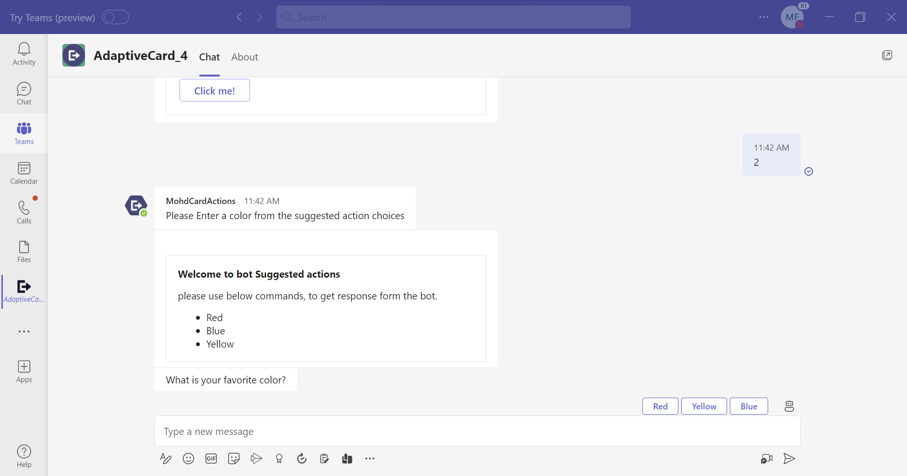
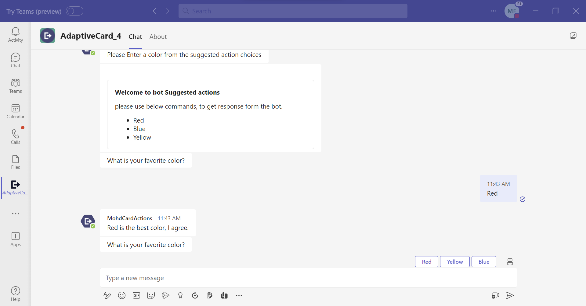

# Send Adaptive Card Including Different Actions

This sample shows the feature where user can send Adaptive Card actions using bot.

## Interaction with app


## Prerequisites

- Microsoft Teams is installed and you have an account
- [.NET SDK](https://dotnet.microsoft.com/download) version 6.0
- [ngrok](https://ngrok.com/download) or equivalent tunnelling solution

- [Teams](https://teams.microsoft.com) Microsoft Teams is installed and you have an account

## Setup
   
1. Setup For Bot
	- Register a AAD aap registration in Azure portal [Azure Active Directory – App Registrations](https://go.microsoft.com/fwlink/?linkid=2083908).
	- Also, register a bot with Azure Bot Service, following the instructions [here](https://docs.microsoft.com/azure/bot-service/bot-service-quickstart-registration?view=azure-bot-service-3.0).
	- Ensure that you've [enabled the Teams Channel](https://docs.microsoft.com/azure/bot-service/channel-connect-teams?view=azure-bot-service-4.0)
	- While registering the bot, use `https://<your_ngrok_url>/api/messages` as the messaging endpoint.

    > NOTE: When you create your app registration, you will create an App ID and App password - make sure you keep these for later.

1. Run ngrok - point to port 3978

   ```bash
     ngrok http -host-header=rewrite 3978
   ``` 
3. Setup For Code

  - Clone the repository
    ```bash
    git clone https://github.com/OfficeDev/Microsoft-Teams-Samples.git
    ```

  - If you are using Visual Studio
 
  - Launch Visual Studio
  - File -> Open Folder
  - Navigate to `samples/bot-adaptive-card-actions/csharp/AdaptiveCardActions` folder
  - Select `AdaptiveCardActions.sln` solution file

   - Modify the `/appsettings.json` and fill in the following details:
     - `{{MicrosoftAppId}}` - Generated from Step 1 is the application app id
     - `{{MicrosoftAppPassword}}` - Generated from Step 1, also referred to as Client secret
  - Press `F5` to run the project
     
4. Setup Manifest for Teams
- __*This step is specific to Teams.*__
    - **Edit** the `manifest.json` contained in the ./AppPackage folder to replace your Microsoft App Id (that was created when you registered your app registration earlier) *everywhere* you see the place holder string `{{Microsoft-App-Id}}` (depending on the scenario the Microsoft App Id may occur multiple times in the `manifest.json`)
    - **Edit** the `manifest.json` for `validDomains` and replace `{{Domain-Name}}` with base Url of your domain. E.g. if you are using ngrok it would be `https://1234.ngrok.io` then your domain-name will be `1234.ngrok.io`.
    - **Zip** up the contents of the `AppPackage` folder to create a `manifest.zip` (Make sure that zip file does not contains any subfolder otherwise you will get error while uploading your .zip package)

- Upload the manifest.zip to Teams (in the Apps view click "Upload a custom app")
   - Go to Microsoft Teams. From the lower left corner, select Apps
   - From the lower left corner, choose Upload a custom App
   - Go to your project directory, the ./AppPackage folder, select the zip folder, and choose Open.
   - Select Add in the pop-up dialog box. Your app is uploaded to Teams.

**Note**: If you are facing any issue in your app, please uncomment [this](https://github.com/OfficeDev/Microsoft-Teams-Samples/blob/main/samples/bot-adaptive-card-actions/csharp/AdaptiveCardActions/AdapterWithErrorHandler.cs#L28) line and put your debugger for local debug.


## Running the sample













## Deploy the bot to Azure

To learn more about deploying a bot to Azure, see [Deploy your bot to Azure](https://aka.ms/azuredeployment) for a complete list of deployment instructions.

## Further reading

- [Actions](https://learn.microsoft.com/adaptive-cards/rendering-cards/actions)
- [Send suggested actions](https://learn.microsoft.com/microsoftteams/platform/bots/how-to/conversations/conversation-messages?tabs=dotnet#send-suggested-actions)


