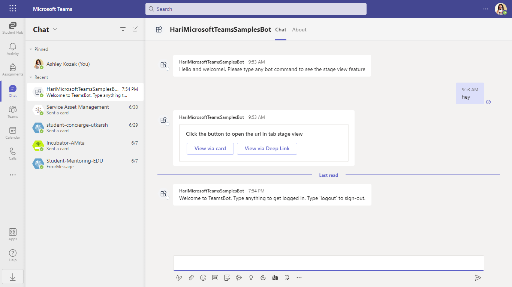
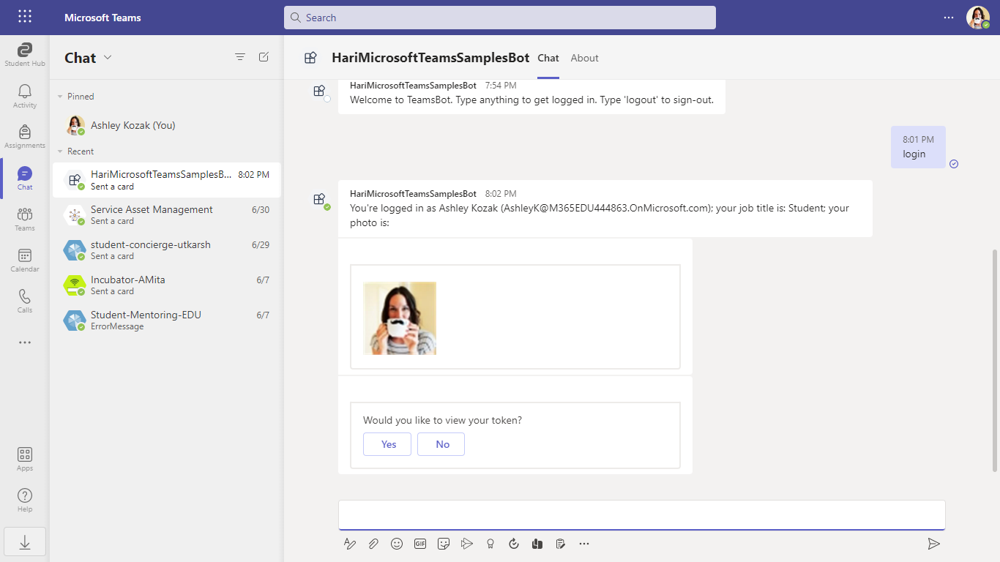
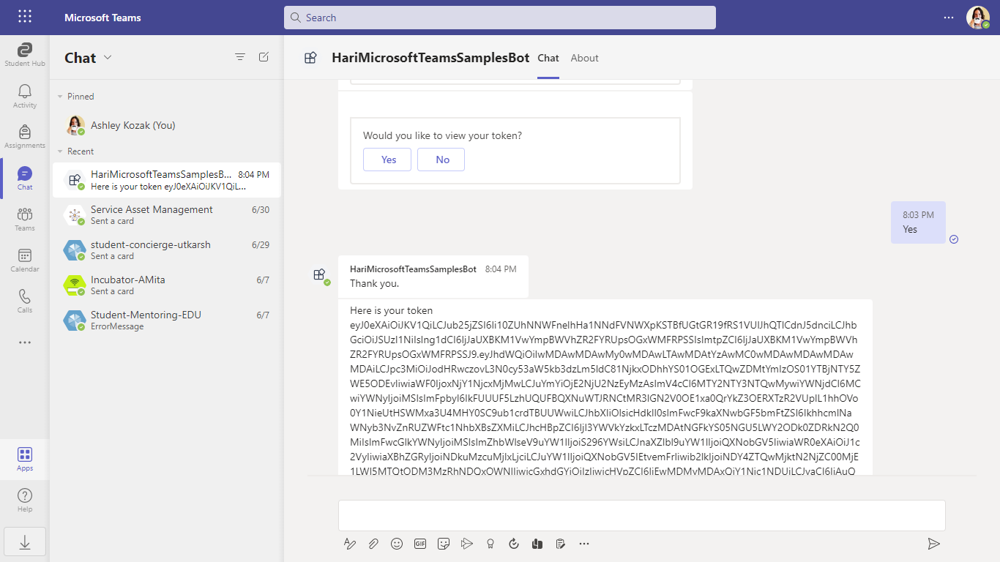

# Teams Conversation Bot SSO quick-start

Teams Bot with SSO using Bot Framework v4.

This bot has been created using [Bot Framework](https://dev.botframework.com), it shows how to get started with SSO in a bot for Microsoft Teams.

The focus of this sample is how to use the Bot Framework support for OAuth SSO in your bot. Teams behaves slightly differently than other channels in this regard. Specifically an Invoke Activity is sent to the bot rather than the Event Activity used by other channels. _This Invoke Activity must be forwarded to the dialog if the OAuthPrompt is being used._ This is done by subclassing the ActivityHandler and this sample includes a reusable TeamsActivityHandler. This class is a candidate for future inclusion in the Bot Framework SDK.

The sample uses the bot authentication capabilities in [Azure Bot Service](https://docs.botframework.com), providing features to make it easier to develop a bot that authenticates users to various identity providers such as Azure AD (Azure Active Directory), GitHub, Uber, etc. The OAuth token is then used to make basic Microsoft Graph queries.

> IMPORTANT: The manifest file in this app adds "token.botframework.com" to the list of `validDomains`. This must be included in any bot that uses the Bot Framework OAuth flow.

## Prerequisites

- Microsoft Teams is installed and you have an account (not a guest account)
-  [NodeJS](https://nodejs.org/en/)
-  [ngrok](https://ngrok.com/) or equivalent tunneling solution
-  [M365 developer account](https://docs.microsoft.com/en-us/microsoftteams/platform/concepts/build-and-test/prepare-your-o365-tenant) or access to a Teams account with the appropriate permissions to install an app.

## To try this sample

> Note these instructions are for running the sample on your local machine, the tunnelling solution is required because
> the Teams service needs to call into the bot.

### 1. Setup for Bot SSO
Refer to [Bot SSO Setup document](../BotSSOSetup.md).
### 2. Configure bot sample

   Update the `.env` configuration for the bot to use the Microsoft App Id and App Password from the Bot Framework registration. (Note the MicrosoftAppId is the AppId created in step 1.1, the MicrosoftAppPassword is referred to as the "client secret" in step1.2 and you can always create a new client secret anytime.)

### 3. Run your bot sample
Under the root of this sample folder, build and run by commands:
- `npm install`
- `npm start`

### 4. Configure and run the Teams app
- **Using App Studio**
    - Open your app in App Studio's manifest editor.
    - Open the *Bots* page under *Capabilities*.
    - Choose *Setup*, then choose the existing bot option. Enter your AAD app registration ID from step 1.1. Select any of the scopes you wish to have the bot be installed.
    - Open *Domains and permissions* from under *Finish*. Enter the same ID from the step above in *AAD App ID*, then and append it to "api://botid-" and enter the URI into *Single-Sign-On*.
    - Open *Test and distribute*, then select *Install*.

- **Manually update the manifest.json**
    - Edit the `manifest.json` contained in the  `appPackage/` folder to replace with your MicrosoftAppId (that was created in step1.1 and is the same value of MicrosoftAppId in `.env` file) *everywhere* you see the place holder string `{TODO: MicrosoftAppId}` (depending on the scenario the Microsoft App Id may occur multiple times in the `manifest.json`)
    - Zip up the contents of the `appPackage/` folder to create a `manifest.zip`
    - Upload the `manifest.zip` to Teams (in the left-bottom *Apps* view, click "Upload a custom app")

You can interact with this bot by sending it a message. The bot will respond by asking for your consent, by this consent the Bot will exchange an SSO token, then making a call to the Graph API on your behalf and returning the results. It will keep you loggined unless you send a message "logout". 

## Further reading

- [Bot Framework Documentation](https://docs.botframework.com)
- [Bot Basics](https://docs.microsoft.com/azure/bot-service/bot-builder-basics?view=azure-bot-service-4.0)
- [Azure Portal](https://portal.azure.com)
- [Add Authentication to Your Bot Via Azure Bot Service](https://docs.microsoft.com/en-us/azure/bot-service/bot-builder-authentication?view=azure-bot-service-4.0&tabs=csharp)
- [Activity processing](https://docs.microsoft.com/en-us/azure/bot-service/bot-builder-concept-activity-processing?view=azure-bot-service-4.0)
- [Azure Bot Service Introduction](https://docs.microsoft.com/azure/bot-service/bot-service-overview-introduction?view=azure-bot-service-4.0)
- [Azure Bot Service Documentation](https://docs.microsoft.com/azure/bot-service/?view=azure-bot-service-4.0)
- [.NET Core CLI tools](https://docs.microsoft.com/en-us/dotnet/core/tools/?tabs=netcore2x)
- [Azure CLI](https://docs.microsoft.com/cli/azure/?view=azure-cli-latest)
- [Azure Portal](https://portal.azure.com)
- [Language Understanding using LUIS](https://docs.microsoft.com/en-us/azure/cognitive-services/luis/)
- [Channels and Bot Connector Service](https://docs.microsoft.com/en-us/azure/bot-service/bot-concepts?view=azure-bot-service-4.0)
- [Microsoft Teams Developer Platform](https://docs.microsoft.com/en-us/microsoftteams/platform/)

